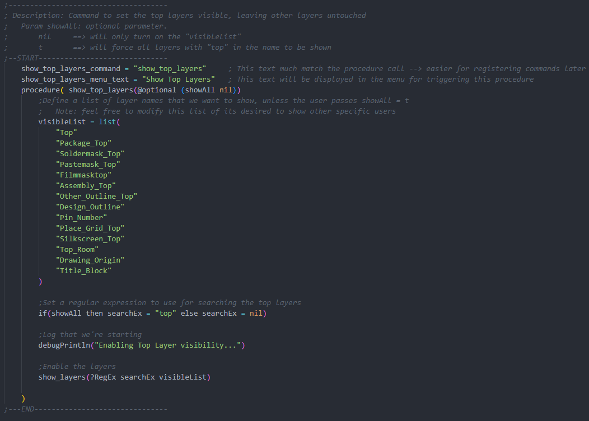

# CadenceScripts - Allegro - Layer Visibility

## Description
The intent of this script is to provide several commands for manipulating layer visibility, without requiring custom views to be saved/loaded/cycled.  After installation, basic layer visibility manipulation (top layer, bottom layer, external layers, all layers, etc..) will be added to the menu toolbar under "Layer Visibility" → "Commands".  More capability is exposed by means of the direct Skill Procedures, including the ability to pass in a list of desired layers to be toggled (in case further permutations of "default views" are desired to be saved to funckeys for example).

## Latest Release
[v0.1.0](_releases_/v0.1.0/) is the latest release.  Older releases can be found within the [\_releases\_](_releases_) folder.

## Automatic Installation
All files necessary for the installation can be found within each release versions subdirectory.

To run the automatic installation, simply run the batch file located at <_release_version_directory_>/installer.bat

## Manual Installation
All files necessary for the installation can be found within each release versions subdirectory.

To install this script for use in your instance of Allegro, please follow these steps:

Place the skill script ("layer_visibility.il") and the skill initialize file ("allegro.ilinit"), found in <_release_version_directory_>/script_files, into the folder: C:\Cadence\SPB_23.1\share\pcb\etc\
Note: if C:\Cadence\SPB_23.1\share\pcb\etc\ already contains a file "allegro.ilinit" (if you've already auto-loaded skill script files before), you can skip that file (but still copy the skill script itself)
After restarting Allegro, the skill script should automatically be loaded and ready for use.

## Using the script - Basic Commands
After installing the script (see "Installation" above), there are a few methods to invoke the basic commands from the table below:

- Invoke via Allegro command line
    - While Allegro is in normal command mode (not in skill script mode), simply type any of the above basic commands into the command window

- Invoke via Funckey (highly recommended)
    - To allow a single keystroke to trigger this command, add the desired basic commands to the env file located at C:\SPB_Data\pcbenv\
        - example: funckey A show_all_layers
    - Note: you can change the "A" to whatever key you would like this command bound to.  For additional env file examples, feel free to browse [Allegro PCB ENV](https://confluence.garmin.com/display/AOEMHW/Allegro+PCB+ENV)

- Invoke via menu
    - By default, the script will add a menu item to the menu bar to allow triggering the script by clicking.  The menu item can be found under "Layer Visibility" → Commands
        - Note: this functionality (adding a menu item) can be disabled by opening "layer_visibility.il" in a text editor, searching for ADDMENU and ensuring it is set to 0

| Basic Allegro Commands 	| Description 	|
|:----------------------	|:-----------	|
| hide_all_layers           | Turn off all layers in the design |
| show_top_layers           | Set all top layers to be visible, leaving existing visible layers untouched |
| show_only_top_layers      | Turn off all layers, leaving only the top layers visible |
| show_bot_layers           | Set all bottom layers to be visible, leaving existing visible layers untouched |
| show_only_bot_layers      | Turn off all layers, leaving only the bottom layers visible |
| show_tb_layers            | Set all top and bottom layers to be visible, leaving existing visible layers untouched |
| show_only_tb_layers       | Turn off all layers, leaving only the top and bottom layers visible |
| show_etch_layers          | Set all copper layers to be visible, leaving existing visible layers untouched |
| show_only_etch_layers     | Turn off all layers, leaving only all copper layers to be visible |
| show_mech_layers          | Set all mechanically relevant layers to be visible, leaving existing visible layers untouched |
| show_all_layers           | Set all layers visible |

## Using the script - Advanced Commands
It may be desirable to have more advanced control than the "Basic Allegro Commands" above provide.  For instance, a user might want to set funckeys or alias various combinations of layer visibility for quickly navigating the layout.  Examples could include: turn on L03 + L04 + L05 to be able to quickly view routing on L04, while also viewing adjacent reference planes (or loosely coupled low-speed routing layers) to keep an eye on critical signals or plane breaks.  This can be done with a single keystroke with the procedures exposed by this script.  The sections below are provided to give background on the available procedures, how to use them, and then lastly how to invoke them by various means.

### Skill Procedures

    
<b><i>hide_all_layers</i></b>

     
    <table>
        <tr>
            <td><b>Description</b>:</td>
            <td>This functions sets all layers to be invisible and can act as a way to have a clean starting point.</td>
        </tr>
        <tr>
            <td><b>Parameters</b>:</td>
            <td>None</td>
        </tr>
        <tr>
            <td><b>Script Example(s)</b>:</td>
            <td>
                <table>
                    <tr>
                        <th>Syntax/API</th>
                        <th>Result</th>
                    </tr>
                    <tr>
                        <td>hide_all_layers()</td>
                        <td>This will turn off all layer visibility</td>
                    </tr>
                </table>
            </td>
        </tr>
    </table>

 

    
<b><i>show_layers(@Key (RegEx nil) @rest layerStrings)</i></b>

     
    <table>
        <tr>
            <td><b>Description</b>:</td>
            <td>This functions sets all layers visible that either contained the RegEx string (case insensitive) or that matched any of the items in the layerString list(s).</td>
        </tr>
        <tr>
            <td><b>Parameters</b>:</td>
            <td>
                <table>
                    <tr>
                        <td>
                            <b>RegEx</b>
                            <ul>
                                <li><b>Expected data type</b>: string</li>
                                <li><b>Passed value</b>: a string that can be passed to force any layer with a subclass that contains this string (anywhere in the name) to be visible</li>
                                <li><b>Example</b>: "top"</li>
                                <li>
                                    <b>Notes</b>:
                                    <ul>
                                        <li>This parameter is optional and can be skipped when calling show_layers() if a RegEx match is not desired</li>
                                        <li>If a string is passed, the string is not case sensitive (i.e. - if "TOP" is passed, any layer with a subclass that contains top in any case will be enable)</li>
                                    </ul>
                                </li>
                            </ul>
                            <b>layerStrings</b>
                            <ul>
                                <li><b>Expected data type</b>: list of strings (can also be a list of lists containing strings)</li>
                                <li><b>Passed value</b>: a list of strings (or a list of lists containing strings) containing the desired subclass names that should be set to visible</li>
                                <li><b>Example</b>: ("top" "L02" "L03") or (("top" "bottom") ("L02" "L03" "L04"))</li>
                                <li>
                                    <b>Notes</b>:
                                    <ul>
                                        <li>This parameter is optional if a RegEx was passed instead</li>
                                        <li>The "@rest" declaration allows the list to be sent as a compiled list, or as individual arguments separated by spaces</li>
                                        <li>These strings are case sensitive and must exactly match the subclass name (a regular expression is not used to search, as it is expected that the user is directly passing the desired layers to enable with this list)</li>
                                    </ul>
                                </li>
                            </ul>
                        </td>
                    </tr>
                </table>
            </td>
        </tr>
        <tr>
            <td><b>Script Example(s)</b>:</td>
            <td>
                <table>
                    <tr>
                        <th>Syntax/API</th>
                        <th>Result</th>
                    </tr>
                    <tr>
                        <td>show_layers(?RegEx "top")</td>
                        <td>This will set any layer that contains the word "top" (case insensitive) in its subclass name</td>
                    </tr>
                    <tr>
                        <td>show_layers(?RegEx "all")</td>
                        <td>This will set any layer that contains the word "all" (case insensitive) in its subclass name (i.e. - "through all" would be enabled for all classes)</td>
                    </tr>
                    <tr>
                        <td>show_layers("top" "L02" "L03")</td>
                        <td>This will set each subclass that matches (exactly → case sensitive) the words "top" or "L02" or "L03"</td>
                    </tr>
                    <tr>
                        <td>show_layers(?RegEx "all" "top" "L02" "L03")</td>
                        <td>This will perform a regular expression (case insensitive) search for the word "all" and enable any layer with that string within its subclass name.  Additionally, the specific subclass matches (case sensitive) for "top", "L02", and "L03" will also be enabled.</td>
                    </tr>
                </table>
            </td>
        </tr>
    </table>

 

    
<b><i>show_top_layers(@optional (showAll nil))</i></b>

     
    <table>
        <tr>
            <td><b>Description</b>:</td>
            <td>This functions sets the desired top layers to be visible.</td>
        </tr>
        <tr>
            <td><b>Parameters</b>:</td>
            <td>
                <table>
                    <tr>
                        <td>
                            <b>showAll</b>
                            <ul>
                                <li><b>Expected data type</b>: boolean</li>
                                <li><b>Passed value</b>: t - to show all layers ; nil - to only show the predefined layers</li>
                                <li>
                                    <b>Notes</b>:
                                    <ul>
                                        <li>When passed with (t) , this function will enable any subclass that contains the word "top" (useful when wanting to see DFA shapes, etc..).  Otherwise, it only enables the bare minimum visibility for the top layer (component outlines, copper, etc..)</li>
                                    </ul>
                                </li>
                            </ul>
                        </td>
                    </tr>
                </table>
            </td>
        </tr>
        <tr>
            <td><b>Script Example(s)</b>:</td>
            <td>
                <table>
                    <tr>
                        <th>Syntax/API</th>
                        <th>Result</th>
                    </tr>
                    <tr>
                        <td>show_top_layers()</td>
                        <td>
                            This will set the predefined list of "top" layers to be visible (component outlines, copper, etc..)
                             
                            Note: this is useful for cleanly viewing the top layer without the clutter of DRC boundaries (but this is not recommended when placing components, since DRC boundaries are hidden)
                        </td>
                    </tr>
                    <tr>
                        <td>show_top_layers(t)</td>
                        <td>
                            This will set any layer that contains the word "top" in its subclass name to visible (in other words, DRC boundaries for the top layer will also be enabled)
                             
                            Note: this is highly recommend to be the setting used while doing placement, since DRC boundaries will be visible for components
                        </td>
                    </tr>
                </table>
            </td>
        </tr>
    </table>

 

    
<b><i>show_only_top_layers(@optional (showAll nil))</i></b>

     
    <table>
        <tr>
            <td><b>Description</b>:</td>
            <td>This is simply a wrapper function to call <b><i>hide_all_layers()</i></b> followed by <b><i>show_top_layers(showAll)</i></b>.  The syntax and description of parameters for this function is identical <b><i>show_top_layers(showAll nil)</i></b>.</td>
        </tr>
    </table>

 

    
<b><i>show_bot_layers(@optional (showAll nil))</i></b>

     
    <table>
        <tr>
            <td><b>Description</b>:</td>
            <td>This functions sets the desired bottom layers to be visible.</td>
        </tr>
        <tr>
            <td><b>Parameters</b>:</td>
            <td>
                <table>
                    <tr>
                        <td>
                            <b>showAll</b>
                            <ul>
                                <li><b>Expected data type</b>: boolean</li>
                                <li><b>Passed value</b>: t - to show all layers ; nil - to only show the predefined layers</li>
                                <li>
                                    <b>Notes</b>:
                                    <ul>
                                        <li>When passed with (t) , this function will enable any subclass that contains the word "bot" (useful when wanting to see DFA shapes, etc..).  Otherwise, it only enables the bare minimum visibility for the bottom layer (component outlines, copper, etc..)</li>
                                    </ul>
                                </li>
                            </ul>
                        </td>
                    </tr>
                </table>
            </td>
        </tr>
        <tr>
            <td><b>Script Example(s)</b>:</td>
            <td>
                <table>
                    <tr>
                        <th>Syntax/API</th>
                        <th>Result</th>
                    </tr>
                    <tr>
                        <td>show_bot_layers()</td>
                        <td>
                            This will set the predefined list of "bottom" layers to be visible (component outlines, copper, etc..)
                             
                            Note: this is useful for cleanly viewing the bottom layer without the clutter of DRC boundaries (but this is not recommended when placing components, since DRC boundaries are hidden)
                        </td>
                    </tr>
                    <tr>
                        <td>show_top_layers(t)</td>
                        <td>
                            This will set any layer that contains the word "bot" in its subclass name to visible (in other words, DRC boundaries for the top layer will also be enabled)
                             
                            Note: this is highly recommend to be the setting used while doing placement, since DRC boundaries will be visible for components
                        </td>
                    </tr>
                </table>
            </td>
        </tr>
    </table>

 

    
<b><i>show_only_bot_layers(@optional (showAll nil))</i></b>

     
    <table>
        <tr>
            <td><b>Description</b>:</td>
            <td>This is simply a wrapper function to call <b><i>hide_all_layers()</i></b> followed by <b><i>show_bot_layers(showAll)</i></b>.  The syntax and description of parameters for this function is identical <b><i>show_bot_layers(showAll nil)</i></b>.</td>
        </tr>
    </table>

 

    
<b><i>show_tb_layers(@optional (showAll nil))</i></b>

     
    <table>
        <tr>
            <td><b>Description</b>:</td>
            <td>This functions sets the desired top and bottom layers to be visible.</td>
        </tr>
        <tr>
            <td><b>Parameters</b>:</td>
            <td>
                <table>
                    <tr>
                        <td>
                            <b>showAll</b>
                            <ul>
                                <li><b>Expected data type</b>: boolean</li>
                                <li><b>Passed value</b>: t - to show all layers ; nil - to only show the predefined layers</li>
                                <li>
                                    <b>Notes</b>:
                                    <ul>
                                        <li>When passed with (t) , this function will enable any subclass that contains the words "top" or "bot" (useful when wanting to see DFA shapes, etc..).  Otherwise, it only enables the bare minimum visibility for the top or bottom layer (component outlines, copper, etc..)</li>
                                    </ul>
                                </li>
                            </ul>
                        </td>
                    </tr>
                </table>
            </td>
        </tr>
        <tr>
            <td><b>Script Example(s)</b>:</td>
            <td>
                <table>
                    <tr>
                        <th>Syntax/API</th>
                        <th>Result</th>
                    </tr>
                    <tr>
                        <td>show_tb_layers()</td>
                        <td>
                            This will set the predefined list of "top" and "bottom" layers to be visible (component outlines, copper, etc..)
                             
                            Note: this is useful for cleanly viewing the top and bottom layers without the clutter of DRC boundaries (but this is not recommended when placing components, since DRC boundaries are hidden)
                        </td>
                    </tr>
                    <tr>
                        <td>show_top_layers(t)</td>
                        <td>
                            This will set any layer that contains the words "top" or "bot" in its subclass name to visible (in other words, DRC boundaries for the top and bottom layers will also be enabled)
                             
                            Note: this is highly recommend to be the setting used while doing placement, since DRC boundaries will be visible for components
                        </td>
                    </tr>
                </table>
            </td>
        </tr>
    </table>

 

    
<b><i>show_only_tb_layers(@optional (showAll nil))</i></b>

     
    <table>
        <tr>
            <td><b>Description</b>:</td>
            <td>This is simply a wrapper function to call <b><i>hide_all_layers()</i></b> followed by <b><i>show_tb_layers(showAll)</i></b>.  The syntax and description of parameters for this function is identical <b><i>show_tb_layers(showAll nil)</i></b>.</td>
        </tr>
    </table>

 

    
<b><i>show_etch_layers(@rest layerIDs)</i></b>

     
    <table>
        <tr>
            <td><b>Description</b>:</td>
            <td>This functions sets the desired etch layer(s) to be visible (note: this will enable all subclasses for that particular layer, but the layer must be part of the cross section → otherwise it will be ignored).</td>
        </tr>
        <tr>
            <td><b>Parameters</b>:</td>
            <td>
                <table>
                    <tr>
                        <td>
                            <b>layerIDs</b>
                            <ul>
                                <li><b>Expected data type</b>: list of layer identifiers (or list of lists)</li>
                                <li><b>Passed value</b>: the layer identifiers can be an integer (identifying the layer number) or a string (identifying the layer's name).  Note: if no value is passed, then all etch layers will be set to visible.</li>
                                <li><b>Example</b>: "top" or 1 or ("top" "L02" "L03") or (1 2 3)</li>
                            </ul>
                        </td>
                    </tr>
                </table>
            </td>
        </tr>
        <tr>
            <td><b>Script Example(s)</b>:</td>
            <td>
                <table>
                    <tr>
                        <th>Syntax/API</th>
                        <th>Result</th>
                    </tr>
                    <tr>
                        <td>show_etch_layers()</td>
                        <td>This will set all layers in the cross section to be visible</td>
                    </tr>
                    <tr>
                        <td>show_etch_layers(1 3 5)</td>
                        <td>This will set the 1st, 3rd, and 5th etch layers to be visible (their names are not important, the script will use their layer order to set the visibility)</td>
                    </tr>
                    <tr>
                        <td>show_etch_layers("top" "L03" "L05")</td>
                        <td>This will set the layer named "top" "L03" and "L05" to be visible (assuming that "top" "L03" and "L05" are the layer names as defined in the cross section)</td>
                    </tr>
                    <tr>
                        <td>show_etch_layers("top" 3 5 "L07")</td>
                        <td>This will set the layers named "top" and "L07" as well as the 3rd and 5th etch layers to be visible</td>
                    </tr>
                </table>
            </td>
        </tr>
    </table>

 

    
<b><i>show_only_etch_layers(@rest layerIDs)</i></b>

     
    <table>
        <tr>
            <td><b>Description</b>:</td>
            <td>This is simply a wrapper function to call <b><i>hide_all_layers()</i></b> followed by <b><i>show_etch_layers(layerIDs)</i></b>.  The syntax and description of parameters for this function is identical <b><i>show_etch_layers(layerIDs)</i></b>.</td>
        </tr>
    </table>

 

    
<b><i>show_mech_layers()</i></b>

     
    <table>
        <tr>
            <td><b>Description</b>:</td>
            <td>This functions sets the mechanically relevant layers to be visible (placement keepin, keepouts, etc..).</td>
        </tr>
        <tr>
            <td><b>Parameters</b>:</td>
            <td>None.</td>
        </tr>
        <tr>
            <td><b>Script Example(s)</b>:</td>
            <td>
                <table>
                    <tr>
                        <th>Syntax/API</th>
                        <th>Result</th>
                    </tr>
                    <tr>
                        <td>show_mech_layers()()</td>
                        <td>This will set the mechanically relevant layers to be visible</td>
                    </tr>
                </table>
            </td>
        </tr>
    </table>

 

    
<b><i>show_all_layers()</i></b>

     
    <table>
        <tr>
            <td><b>Description</b>:</td>
            <td>This is simply a wrapper function to call <b><i>hide_all_layers()</i></b> → <b><i>show_top_layers(t)</i></b> → <b><i>show_bot_layers(t)(t)</i></b> → <b><i>show_etch_layers()</i></b> → <b><i>show_mech_layers()</i></b>.</td>
        </tr>
    </table>

 

### Invoking the Skill Procedures
To directly invoke the Skill Procedures, there are a couple options:
- Invoke via Allegro command line
    - Allegro's command line can invoke any Skill Procedure by preceding the function call with the word "skill"
        - example: skill show_only_etch_layers(1 3 5)
        - example: skill show_layers(?RegEx "bottom")
- Invoke via Funckey (highly recommended)
    - To allow a single keystroke to trigger this command, add the desired "skill wrapped procedure" commands to the env file located at C:\SPB_Data\pcbenv\
        - example: alias 123 skill show_etch_layers(1 2 3)

## Modifying Preset Layer Commands
If a user would like to modify the default preset layers (for example, to allow the "show_top_layers" command to include more layers than are currently shown, or even to make their own functions for other layer combinations) → this can be done with minimal modifications/tweaks to the "layer_visibility.il" file.  As defined in the show_layers() procedure above, this allows passing any regular expression or list of layers that are desired to be shown.  Therefore, invoking this function with the desired predefined list (or regular expression) is all that's needed to achieve this.  For instance, if a user wants the show_top_layers() command to include more layers, then simply edit the visibleList list of the show_top_layers() procedure in the layer_visibility.il file:

## Author(s)
- Author(s): Ryan Klassing
- Copyright (C) 2017-2025 Ryan Klassing.
- Released under the MIT license.

## License

MIT License

Copyright (c) 2017-2025 Ryan Klassing

Permission is hereby granted, free of charge, to any person obtaining a copy
of this software and associated documentation files (the "Software"), to deal
in the Software without restriction, including without limitation the rights
to use, copy, modify, merge, publish, distribute, sublicense, and/or sell
copies of the Software, and to permit persons to whom the Software is
furnished to do so, subject to the following conditions:

The above copyright notice and this permission notice shall be included in all
copies or substantial portions of the Software.

THE SOFTWARE IS PROVIDED "AS IS", WITHOUT WARRANTY OF ANY KIND, EXPRESS OR
IMPLIED, INCLUDING BUT NOT LIMITED TO THE WARRANTIES OF MERCHANTABILITY,
FITNESS FOR A PARTICULAR PURPOSE AND NONINFRINGEMENT. IN NO EVENT SHALL THE
AUTHORS OR COPYRIGHT HOLDERS BE LIABLE FOR ANY CLAIM, DAMAGES OR OTHER
LIABILITY, WHETHER IN AN ACTION OF CONTRACT, TORT OR OTHERWISE, ARISING FROM,
OUT OF OR IN CONNECTION WITH THE SOFTWARE OR THE USE OR OTHER DEALINGS IN THE
SOFTWARE.
