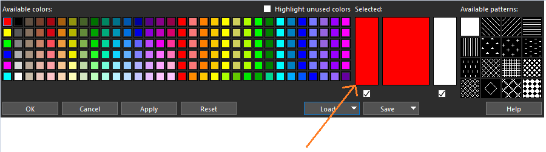

# CadenceScripts - Allegro - Load PCB Colors

## Description
The intent of this script is to simplify the loading of color files based on the quantity of layers within a particular cross section (stackup).  This is most useful when using a ROYGBIV color pattern for layers (since ROYGBIV attempts to define a standardization of colors flowing through a PCB layer by layer).  However, this script can be used with any desired color palette (instructions will be included below for how to customize the colors).

The default color palette mapping is shown at the bottom of the page in the section "Default ROYGBIV palette" (but as mentioned, the color mapping can be customized as desired).

## Latest Release
[v0.1.1](_releases_/v0.1.1/) is the latest release.  Older releases can be found within the [\_releases\_](_releases_) folder.

## Automatic Installation
All files necessary for the installation can be found within each release versions subdirectory.

To run the automatic installation, simply run the batch file located at <_release_version_directory_>/installer.bat

## Manual Installation
All files necessary for the installation can be found within each release versions subdirectory.

To install this script for use in your instance of Allegro, please follow these steps:

1) Create the following directory, if it doesn't exist: C:\Cadence\PCB_colors\
2) Place the color palette ("ROYGBIV_palette.col") and all color parameter files ("*.prm"), found in <_release_version_directory_>/color_files, into the folder: C:\Cadence\PCB_colors\
3) Place the skill script ("load_pcb_colors.il") and the skill initialize file ("allegro.ilinit"), found in <_release_version_directory_>/script_files, into the folder: C:\Cadence\SPB_23.1\share\pcb\etc\
    - Note: if C:\Cadence\SPB_23.1\share\pcb\etc\ already contains a file "allegro.ilinit" (if you've already auto-loaded skill script files before), you can skip that file (but still copy the skill script itself)
4) After restarting Allegro, the skill script should automatically be loaded and ready for use

## Using the script - Basic Commands
After installing the script (see "Installation" above), there are a few methods to invoke the basic commands from the table below:

- Invoke via Allegro command line
    - To manually execute the script after it's been auto-loaded, simply type "load_pcb_colors" into the command window in Allegro

- Invoke via Funckey (highly recommended)
    - To allow a single keystroke to trigger this command, add the following line to the env file located at C:\SPB_Data\pcbenv\
        - example: funckey C load_pcb_colors
    - Note: you can change the "C" to whatever key you would like this command bound to.  For additional env file examples, feel free to browse [Allegro PCB ENV](https://confluence.garmin.com/display/AOEMHW/Allegro+PCB+ENV)

- Invoke via menu
    - By default, the script will add a menu item to the menu bar to allow triggering the script by clicking.  The menu item can be found under "Colors" → "Load Color File"
        - Note: this functionality (adding a menu item) can be disabled by opening "load_pcb_colors.il" in a text editor, searching for ADDMENU and ensuring it is set to 0

## Customizing the color palette
Any color palette can be used, if the user does not prefer the ROYGBIV pattern.  To do so, follow these steps:

1) Open Allegro, preferably to a .brd that contains 16L, as this will allow the palette to be created and applied for all layer counts up to 16L.
    - Note: this .brd file is only needed to create a palette, so simply open the cross section and add temporary layers if needed to reach 16L
2) Ensure all layer names match the Garmin standard: TOP L02 L03 .... L14 L15 BOTTOM
    - The layer names can be edited within the cross section editor if necessary (again, this is a temporary step only for the color palette creation → layer names can be reverted later if desired)
3) Open the Color editor by clicking , by typing "color192" into the command window, or by selecting the menu Display → Color/Visibility
4) Edit the 16 colors in the bottom right corner of the palette, where the left most is TOP and counts up until BOTTOM, as shown below:
    - 
    - Note: clicking the large area immediately to the right of the palette will expose an RGB color picker, in case you prefer to assign color values numerically:
        - 
5) Once satisfied with all colors, select Save → Save color palette → navigate to C:\Cadence\PCB_colors\ (if this doesn't exist, see 'installation' section above') → save the palette with whatever name you wish
6) Navigate to C:\Cadence\SPB_23.1\share\pcb\etc and open "load_pcb_colors.il" with a text editor
    - CTRL+F to search in the file and look for PALETTE_NAME and update its value to be the filename you created in step 5.
7) The color palette is now updated and should automatically work with all of the layer assignment parameter files, you can now close Allegro (or run the script → see "Using the script" above)

## Default ROYGBIV palette
By default, this script's files will implement a ROYGBIV color palette to consistently transition through the color wheel based on the layer (and to drive consistency across designs with different layer counts).  The intent with this methodology is to make it easier for team members to quickly navigate multiple PCB files (for quickly understanding routing layers in a design review, for example).  Below is a visualization to help demonstrate the deployed layer color strategy:

 

## Author(s)
- Author(s): Ryan Klassing
- Copyright (C) 2017-2025 Ryan Klassing.
- Released under the MIT license.

## License

MIT License

Copyright (c) 2017-2025 Ryan Klassing

Permission is hereby granted, free of charge, to any person obtaining a copy
of this software and associated documentation files (the "Software"), to deal
in the Software without restriction, including without limitation the rights
to use, copy, modify, merge, publish, distribute, sublicense, and/or sell
copies of the Software, and to permit persons to whom the Software is
furnished to do so, subject to the following conditions:

The above copyright notice and this permission notice shall be included in all
copies or substantial portions of the Software.

THE SOFTWARE IS PROVIDED "AS IS", WITHOUT WARRANTY OF ANY KIND, EXPRESS OR
IMPLIED, INCLUDING BUT NOT LIMITED TO THE WARRANTIES OF MERCHANTABILITY,
FITNESS FOR A PARTICULAR PURPOSE AND NONINFRINGEMENT. IN NO EVENT SHALL THE
AUTHORS OR COPYRIGHT HOLDERS BE LIABLE FOR ANY CLAIM, DAMAGES OR OTHER
LIABILITY, WHETHER IN AN ACTION OF CONTRACT, TORT OR OTHERWISE, ARISING FROM,
OUT OF OR IN CONNECTION WITH THE SOFTWARE OR THE USE OR OTHER DEALINGS IN THE
SOFTWARE.
